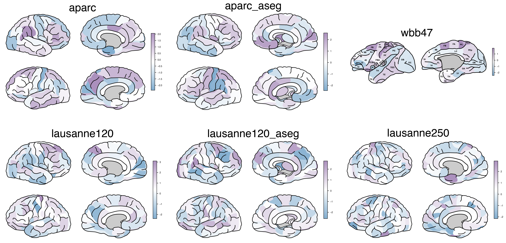

# simple-brain-plot

`simple-brain-plot` is a pure-Python, pip-installable port of the MATLAB
[`Simple-Brain-Plot`](https://github.com/dutchconnectomelab/Simple-Brain-Plot)
package. It creates simple line-art SVG brain plots, coloring each region
of a chosen atlas according to a value and colormap you provide.



## Atlases available

- `aparc` — Desikan-Killiany cortical atlas (68 regions) [1]
- `aparc_aseg` — Desikan-Killiany atlas + subcortical ASEG segmentation (82 regions) [1]
- `lausanne120` — 120-region Cammoun sub-parcellation of Desikan-Killiany (114 regions) [2]
- `lausanne120_aseg` — as above + subcortical ASEG segmentation (128 regions) [2]
- `lausanne250` — 250-region Cammoun sub-parcellation (219 regions) [2]
- `wbb47` — 39-region combined Walker-von Bonin and Bailey macaque parcellation [3][4][5][6]

## Installation

```bash
cd simple-brain-plot
pip install .
```

## Usage

```python
import numpy as np
import simple_brain_plot as sbp

OUT_DIR = "figures"

# Colormap for brain regions. Any matplotlib colormap is accepted like 'RdBu_r', 'Spectral_r', 'viridis', 'plasma', etc.
# Custom colormaps
cmap = sbp.common_cmap('c2')  # c1-12 are custom colormaps

# Custom three point colormap
# cmap = sbp.three_point_cmap(cool="#79C", mid="white", warm="#b85d4a") 

## Option 1
for atlas in sbp.list_atlases():
    regions = sbp.list_regions(atlas)
    values = np.random.randn(len(regions))

    fig = sbp.plot_brain_figure(
        regions,
        values,
        cmap=cmap,
        atlas=atlas,
        save_path=f"{OUT_DIR}/{atlas}.svg",
    )

## Option 2
for atlas in sbp.list_atlases():
    regions = sbp.list_regions(atlas)
    values = np.random.randn(len(regions))

    result = sbp.plot_brain(
        regions,
        values,
        cmap=cmap,
        atlas=atlas,
        save_path=f"{OUT_DIR}/{atlas}.svg",
    )
```

`plot_brain` returns a `PlotBrainResult` with:

- `svg_path`: path to the generated, self-contained `.svg` file (the
  colorbar is embedded as a base64 data URI — no external files needed).
- `svg`: the SVG markup itself, so it also renders inline in Jupyter.

### API

```
plot_brain(regions, values, cmap="RdBu_r", *, atlas="lausanne120",
           limits=None, scaling=0.1, save_path=None, viewer=False)
```

| Argument     | Description |
|--------------|-------------|
| `regions`    | Sequence of region names (see `list_regions(atlas)`) |
| `values`     | Numeric values, one per region |
| `cmap`       | Matplotlib colormap name / `Colormap`, or an `(N, 3)` RGB array |
| `atlas`      | One of the atlas names listed above (default `"lausanne120"`) |
| `limits`     | `(vmin, vmax)`; defaults to `(min(values), max(values))` |
| `scaling`    | Output SVG scale factor, `0 < scaling <= 1` (default `0.1`) |
| `save_path`  | Output path; a temp file is used if omitted |
| `viewer`     | Open the result in your default browser (default `False`) |

`list_atlases()` and `list_regions(atlas)` are also exported as helpers.

### Matplotlib figure output (`plot_brain_figure`)

If you'd rather get back a Matplotlib `Figure` you can style further and
save with `fig.savefig(...)`, use `plot_brain_figure` instead of
`plot_brain`. It rasterizes the brain artwork and draws a real Matplotlib
colorbar next to it (size- and font-adjustable), rather than baking a
colorbar image into the SVG.

```python
import numpy as np
import simple_brain_plot as sbp

regions = sbp.list_regions("aparc")
values = np.random.randn(len(regions))

fig = sbp.plot_brain_figure(
    regions,
    values,
    cmap="RdBu_r",
    atlas="aparc",
    colorbar_label="z-score",
    colorbar_fraction=0.025,   # colorbar width, as a fraction of the image axes
    colorbar_shrink=0.6,       # colorbar length
    colorbar_fontsize=6,       # tick/label font size, in points
    colorbar_fontfamily="Helvetica",
    savepath="/figure/test.svg"
)
fig.savefig("figures/example.png", dpi=300, bbox_inches="tight")
```

`plot_brain_figure` requires the optional `cairosvg` dependency to
rasterize the SVG artwork:

```bash
pip install simple-brain-plot[figure]
```

Key colorbar sizing/styling arguments (all keyword-only):

| Argument              | Description                                            | Default       |
|------------------------|---------------------------------------------------------|---------------|
| `colorbar_fraction`   | Colorbar width as a fraction of the image axes' width   | `0.025`       |
| `colorbar_shrink`     | Scales the colorbar's length                            | `0.6`         |
| `colorbar_pad`        | Gap between the brain image and the colorbar            | `0.02`        |
| `colorbar_aspect`     | Length-to-width ratio of the colorbar                   | `15`          |
| `colorbar_fontsize`   | Font size (pt) of tick labels / label                   | `6`           |
| `colorbar_fontfamily` | Font family of tick labels / label                      | `"Helvetica"` |
| `colorbar_label`      | Optional text label drawn alongside the colorbar        | `None`        |
| `save_path`           | Path to save the figure. If None, nothing saved         | `None`        |

## Differences from the MATLAB version

- Pure Python/NumPy/Matplotlib, no MATLAB required.
- Accepts any Matplotlib colormap by name, in addition to explicit RGB
  matrices.
- The generated SVG embeds its colorbar as a base64 data URI instead of
  referencing an external PNG file, so the output is a single portable file.
- `viewer=True` opens the SVG with the standard library's `webbrowser`
  module.

## References

[1] Desikan RS, et al. An automated labeling system for subdividing the human cerebral cortex on MRI scans into gyral based regions of interest. *NeuroImage*, 31(3):968–80, 2006.

[2] Cammoun L, et al. Mapping the human connectome at multiple scales with diffusion spectrum MRI. *J Neurosci Methods*, 203(2):386–397, 2012.

[3] Scholtens LH, Schmidt R, de Reus MA, van den Heuvel MP. Linking macroscale graph analytical organization to microscale neuroarchitectonics in the macaque connectome. *J Neurosci*, 34(36):12192-12205, 2014.

[4] Stephan KE, et al. Computational analysis of functional connectivity between areas of primate cerebral cortex. *Philos Trans R Soc Lond B Biol Sci*, 355:111–126, 2000.

[5] von Bonin G, Bailey P. The neocortex of Macaca mulatta. 1947.

[6] Walker EA. A cytoarchitectural study of the prefrontal area of the macaque monkey. *J Comp Neurol*, 73:59–86, 1940.

## Attribution

This package is a Python port that bundles the atlas artwork and region
definitions from the original MATLAB project. If you use it in your
research, please cite the original work:

> Scholtens, Lianne H, de Lange, Siemon C, and van den Heuvel, Martijn P.
> 2021. "Simple Brain Plot". Zenodo. https://doi.org/10.5281/zenodo.5346593

Original repository: https://github.com/dutchconnectomelab/Simple-Brain-Plot

See `LICENSE` for licensing details of this Python port.
